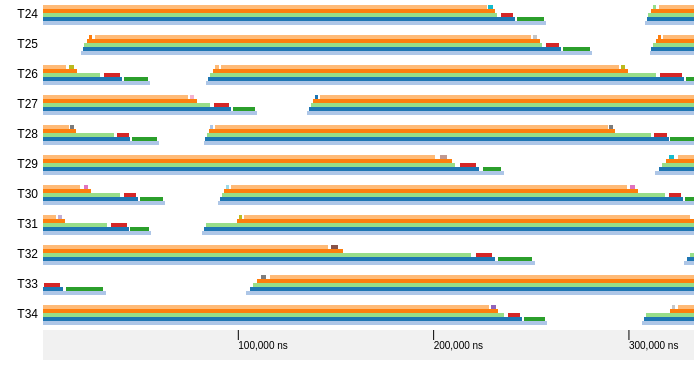
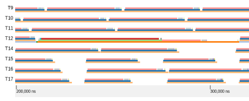
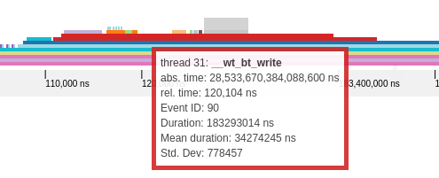
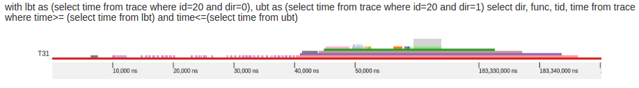

**Demo:** https://dinamite-toolkit.github.io/timesquared/

# TimeSquared

TimeSquared is a web browser application which visualizes DINAMITE traces. These trace visualizations display function calls alongside a program execution timeline. TimeSquared can be used as a tool to aid performance debugging and software comprehension.

## Use Cases

TImeSquared aims to visualize DINAMITE traces to fulfill two main goals:
1. ***Visualize Program Performance***: visually depict the program's exeuciton performance with respect to time
2. ***Navigate Massive Execution Traces***: provide a means to summarize, query, and filter events from massive execution traces

### Viewing Program Execution

TimeSquared's primary function is to display program execution events (ie. function invocations) over time. This visualization allows users to understand how multithreaded applications are behaving with respect to execution time.

### Viewing Statistical Metrics

To further aid users in understanding events in their program traces, TimeSquared can display statistical metrics of events. This alows an inquiring user to quantitatively determine the usual behaviour of a funtion call by observing the mean and standard deviation of event durations for all occurances of a specific event throughout a trace.

### Querying Trace Regions

Although users can manually navigate large trace visualizations by scrolling. TimeSquared provides a SQL query interface so that users can quickly search for specific sections of the trace.

For example, a user can write a custom SQL query to visualize a portion of the trace containing some event that required an abnormal amount of exeuction time (see figure above).

---

Contributors: Augustine Wong, Derek Chan